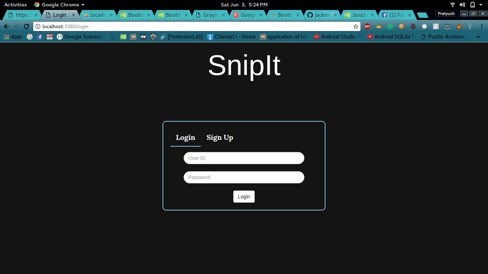
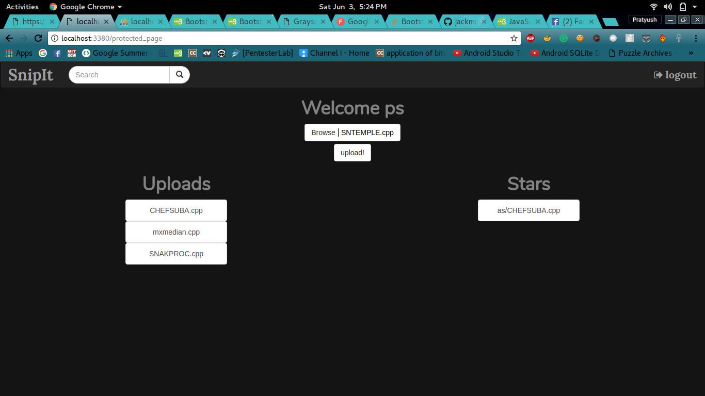
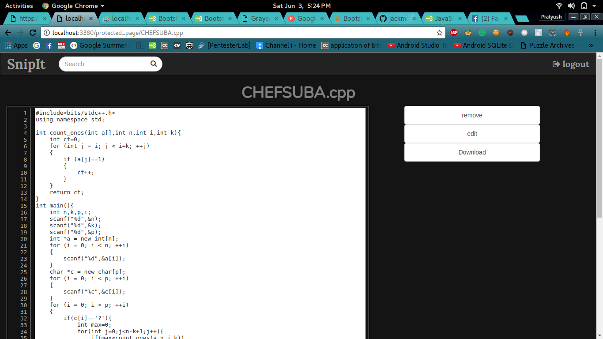
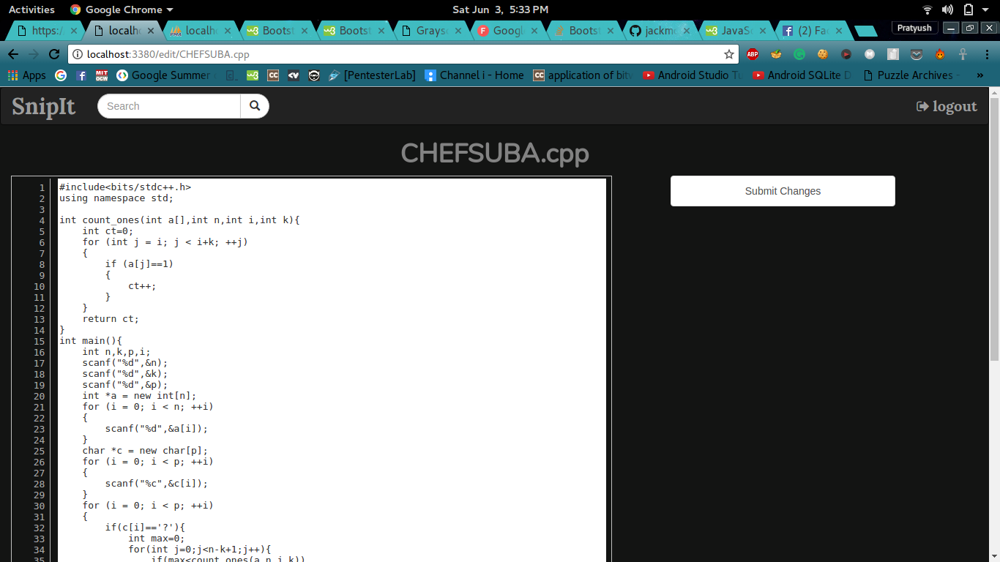
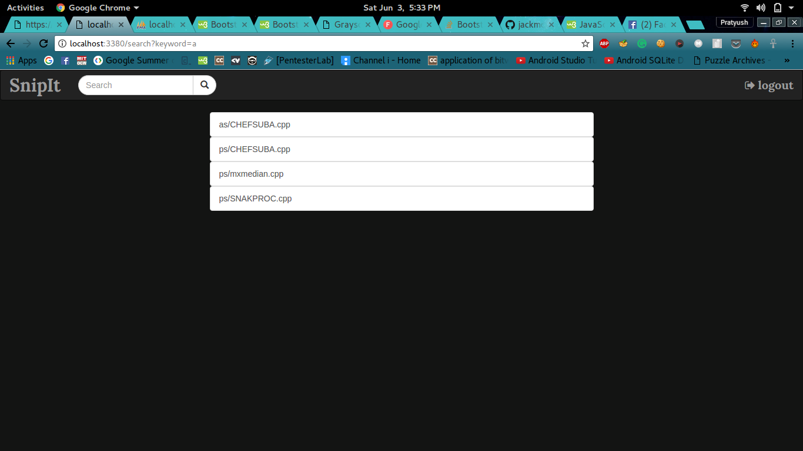

# SnipIt

A simple code snippet management and sharing portal.

SnipIt is a webapp that allows you to store your snippets of code over the cloud and allows you to share them with your fellow developers. 
## Technology Stack 
Frontend: Javascript, HTML, CSS
Backend: Nodejs
## User Functionality 
* Share and store snippets of code over the cloud thus laying waste to any redundant pieces of technology for marking down code.
* Easy creation and deletion of code snippets 
* Set the view to public to allow people to view snippets of code that have been uploaded by you. Other people also have a option to download the snippets for themselves.
* Allows users to show their appreciation for the snippets made public and by their fellow developers also bookmark them by "starring" them.
* Cloud based storage hence stays safe in case of any unforeseen circumstances 

## set up

Clone the repositry
Enter your MySQL database details in create-database and config file
Run the create-database file
Run server

## Screenshot

Login

profile

Files

EditArea

Search

